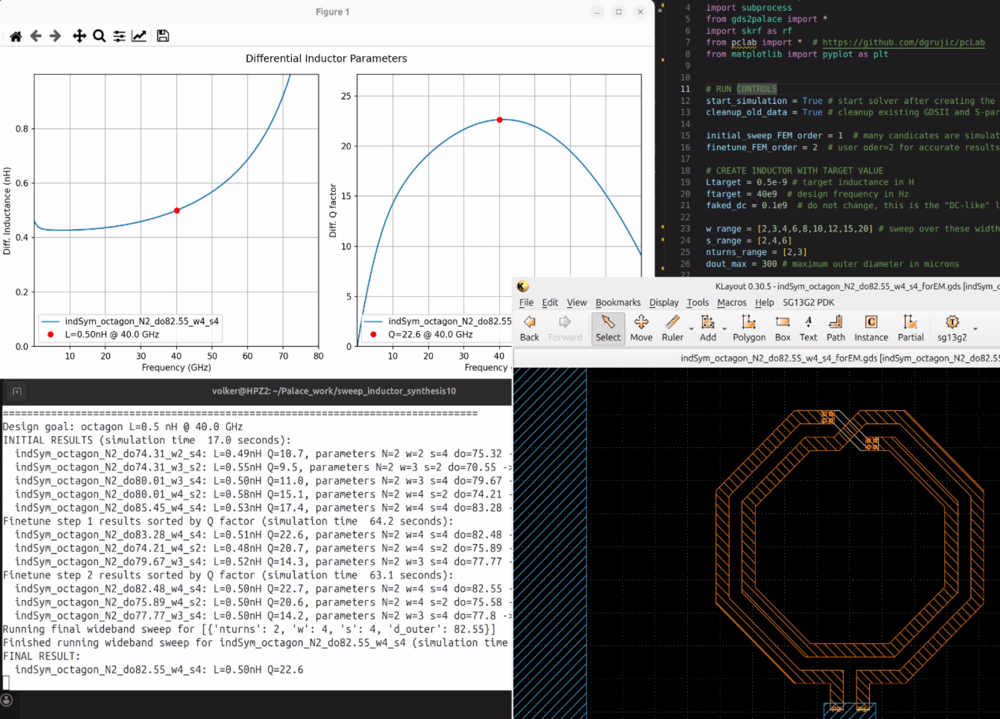

# Inductor synthesis using gds2palace and pcLab

The gds2palace example provided here creates a symmetric inductor layout in IHP SG13G2 technology fully automatically, based on a target L value at a target frequency. The geometry sweep range where possible implementations are evaluated is defined in the model code: range for width, spacing, number of turns. 

The layout implementation is done by pcLab. pcLab is a collection of Python classes that generate GDSII layouts of integrated passive structures such as inductors and baluns, created by Dušan Grujić.



## Principle of operation

This is what this script does for you:

- Step 1: Determine list of possible implementations based on close form equations, by calculating the required diameter and testing if this layout is valid and within a given maximum diameter limit. 
- Step 2: Create GDSII layouts for all these candidates using pcLab library
- Step 3: Create simulation ready GDSII layouts for gds2palace (including ports + ground return) using pin2port function
- Step 4: Run a fast FEM sweep over all candidates using gds2palace
- Step 5: Evaluate the n candidates with highest Q factor at target frequency and re-tune to target value at target frequency
- Step 6: After m iterations over step 5, select the candidate with the highest Q factor and do a wideband full sweep using gds2palace FEM with full accuracy.
- Step 7: Plot results for L and Q factor of that best candidate

The gds2palace FEM simulation flow runs in non-GUI mode here, so that there is no user action required while the script is processing data. 
```
settings['no_gui'] = True  # create files without showing 3D model
```


## Usage

Acticate the Python venv where you can run gds2palace models. gds2palace must be installed as a Python module: pip install gds2palace. The Palace solver must be available and you must be able to run gds2palace models. If you are not familar with gds2palace, go to the gds2palace documentation [here](https://github.com/VolkerMuehlhaus/gds2palace_ihp_sg13g2).

In the `synthesize_inductor_v10.py` script, set your target L value and target frequency, and adjust the search range for w,s and number of turns. Then just run the Python script.


## Limitations

This is an early version of the inductor workflow, and the resulting GDSII inductor layout does NOT yet include the extra "nofill" and "NoRCX" polygons and pins. At the moment, you only get the "raw" metal and via shapes. This is work in progress, the plan is to provide the full final layout in future versions.

At the moment, you might want to use this script to calculate the best geometry parameters, and then use these values with the inductor2/inductor3 pcell provided by IHP.
